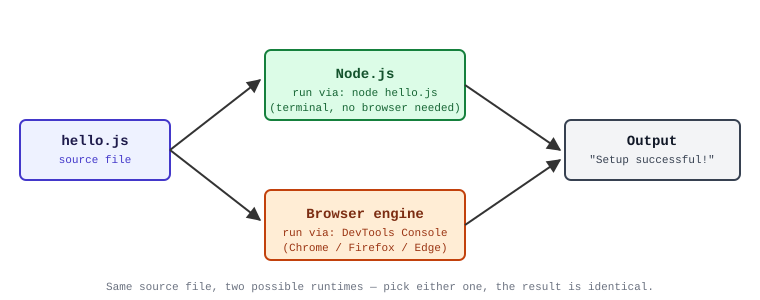

# Lesson 00: Setting Up Your Environment

Before we write a single line of JavaScript, we need a way to run it and a place to write it.

This lesson is short on purpose. Get the tools installed, verify they work, then move on.

---

## What You Need

1. A **JavaScript runtime** (Node.js recommended, or a modern browser)
2. A **text editor** or IDE
3. A terminal (Command Prompt / PowerShell / Terminal / bash)

You can do the first many lessons entirely in the browser console, but installing Node.js early is better — it matches how most real projects run.

---

## 1. Install Node.js

### All platforms (recommended)

1. Go to [https://nodejs.org](https://nodejs.org)
2. Download the **LTS** version
3. Run the installer (accept defaults)

**Verify:**

```bash
node --version
npm --version
```

You should see version numbers (e.g. `v22.x.x` and `10.x.x`).

### Alternative: Browser only

Open Chrome, Firefox, or Edge → press `F12` (or `Cmd+Option+I` on Mac) → go to the **Console** tab.  
You can type JavaScript directly there. Useful for quick experiments, but limited for saving files and later lessons.

---

## 2. Choose an Editor

Any of these work well:

| Tool              | Notes                                      |
|-------------------|--------------------------------------------|
| **VS Code**       | Free, excellent JS support, recommended    |
| **WebStorm**      | Powerful IDE (free for students)           |
| **Vim / Neovim**  | Fast once you learn it                     |
| **Cursor / Zed**  | Modern alternatives                        |

**VS Code quick start:**
1. Install [VS Code](https://code.visualstudio.com/)
2. The built-in JavaScript support is already good
3. Optional: install “ESLint” and “Prettier” extensions later
4. Open a folder → create a `.js` file → you’re ready

---

## 3. Create a Test File

Create a file named `hello.js`:

```js
console.log("Setup successful!");
```

---

## 4. Run It

Open a terminal in the same folder as `hello.js` and run:

```bash
node hello.js
```

You should see:

```
Setup successful!
```

**Browser alternative:** open the Console and type the same `console.log` line, then press Enter.

If that worked — congratulations. Your environment is ready.

---

## The Big Picture

The same `hello.js` file can run in two different places — a terminal via Node.js, or a browser's console — and either path prints the same output. In words: `hello.js` feeds into either Node.js (`node hello.js`, in a terminal) or a browser engine (typed into DevTools' Console tab); both print `"Setup successful!"`.

```text
                      ┌────────────────────┐
                      │      Node.js       │
                      │   node hello.js    │
                 ┌───▶│     (terminal)     │────┐
                 │    └────────────────────┘    │
                 │                              │
┌────────────┐   │                              │   ┌────────────────────┐
│  hello.js  │───┤                              ├──▶│       Output       │
│  (source)  │   │                              │   │"Setup successful!" │
└────────────┘   │                              │   └────────────────────┘
                 │                              │
                 │    ┌────────────────────┐    │
                 │    │   Browser engine   │    │
                 └───▶│  DevTools console  │────┘
                      └────────────────────┘
```



---

## Common Problems

| Problem                        | Fix                                      |
|--------------------------------|------------------------------------------|
| `node: command not found`      | Node.js not installed or not in PATH     |
| Old Node version               | Download the current LTS from nodejs.org |
| Permission errors on Windows   | Run terminal as Administrator if needed  |
| File not found                 | Make sure you are in the correct folder  |

---

## Next Lesson

→ [Lesson 01: Hello, World & Your First Program](01-hello-world.md)
